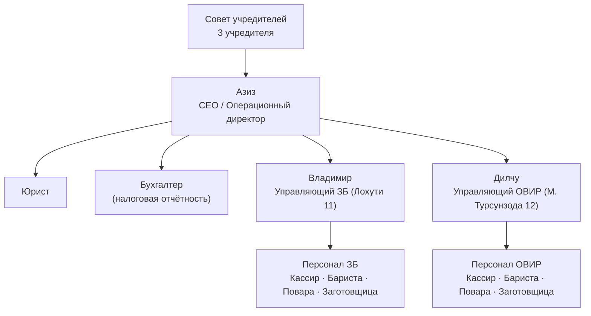

# Организационная структура — Ромашка

#project/romashka #area/career

---

## Схема

---

## Роли и зоны ответственности

### Азиз — CEO / Операционный директор
- Стратегия и развитие сети
- Операционный контроль всех точек
- Финансовое управление и бюджет
- Найм управляющих
- Отношения с учредителями
- Открытие новых точек

### Управляющий точки
- Ежедневная операционная работа точки
- Управление сменами и персоналом
- Выполнение стандартов и SOP
- Отчётность перед CEO (ежедневно/еженедельно)
- Контроль качества продукта и сервиса
- Закупки и склад точки

### Бухгалтер
- Налоговая и юридическая отчётность
- *Зона ответственности: только внешняя отчётность*
- *Внутренний учёт P&L — зона Азиза*

### Юрист
- Договоры, аренда, трудовые отношения
- Регуляторные вопросы

### Кассир
- Обслуживание гостей, расчёт
- Работа с Poster
- Открытие/закрытие кассы по SOP

### Бариста
- Приготовление напитков по стандарту
- Контроль качества кофе и бара

### Повар
- Приготовление блюд по рецептурным картам
- Контроль FIFO, сроки годности

### Уборщица / Заготовщица
- Заготовка по листу заготовок
- Санитарное состояние точки

---

## Пробелы при масштабировании до 6 точек

При росте с 2 до 6 точек потребуются:

| Роль | Когда нужна | Функция |
|------|-------------|---------|
| Старший управляющий / Area Manager | С 4-й точки | Надзор за несколькими точками |
| Технолог / Шеф | ⚠️ Нужен сейчас | ТТК есть, но никто не отвечает за соблюдение и обновление |
| HR-менеджер | С 3-й точки | Найм, обучение, текучка |
| Маркетолог | С 3-й точки | Продвижение, акции |

---

## История изменений

- 2026-04-14 — первичная фиксация структуры

---

## Связанные

→ `[[1-Projects/romashka/0_Romashka_Index|Ромашка — Операционная система]]`
→ `[[1-Projects/romashka/management/Оргструктура_Ромашка|Оргструктура — роли, KPI, полномочия (полная версия)]]`
