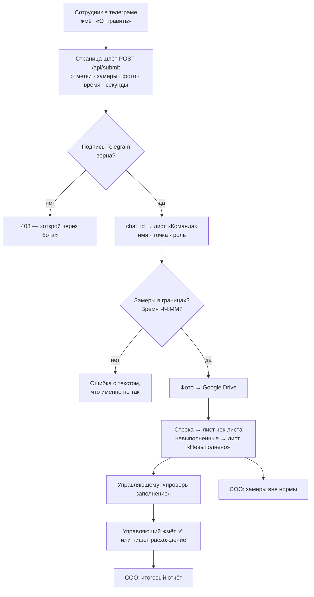

# Устройство системы

Как собран Mini App и бот: слои, поток данных, принятые решения и границы.
Читается перед тем, как что-то менять.

Всего кода: **~1 340 строк Python** и **один HTML-файл на 341 строку**.
Внешних зависимостей две — `requests` и клиент Google. Ни фреймворка,
ни базы данных, ни сборки фронтенда.

---

## 1. Слои

| Слой | Файл | Строк | За что отвечает |
|---|---|---:|---|
| Клиент | `web/index.html` | 341 | вся страница: разметка, стили, логика |
| Транспорт | Telegram | — | доставка и **подпись личности** |
| Сервер | `app/webapp.py` | 174 | 4 эндпоинта, проверка подписи |
| Логика | `app/bot.py` | 643 | чат-бот, валидация, уведомления, второй контур |
| Правила | `app/config.py` | 81 | переменные окружения + чек-листы из JSON |
| Хранение | `app/storage.py` | 206 | Google Sheets и Drive |
| Отчёты | `app/reports.py` | 182 | день и неделя с выводами |
| Запуск | `app/main.py` | 52 | поднимает Mini App и бота в одном процессе |
| Данные | `checklists.romashka.json` | 455 | сами чек-листы — не код |

Ключевое: **Mini App и бот — один процесс и одна логика.** `webapp.py`
импортирует `bot.py` и зовёт те же `parse_time`, `parse_measure`,
`notify_check`, `norm_alerts`. Правило, написанное один раз, действует
в обоих входах. Разъехаться они не могут.

---

## 2. Что происходит при отправке

Пошагово:

1. **Клиент собирает пакет.** Отметки, замеры, время, комментарий, фото
   и `seconds` — сколько человек реально заполнял. Кнопка «Отправить»
   неактивна, пока не закрыто всё обязательное.
2. **Фото ужимается на устройстве** — до 1280 px по длинной стороне,
   JPEG 75 %. В сеть уходит уже лёгкая картинка, а не снимок с камеры.
3. **Сервер проверяет подпись.** `HMAC-SHA256`, ключ — `HMAC("WebAppData", токен бота)`.
   Подделать нельзя, не зная токена. Паролей в системе нет вообще.
4. **Личность берётся из листа «Команда»** по `chat_id`: имя, точка, роль.
   Нет в листе — доступа нет, но человек видит свой ID и запрос уходит руководителю.
5. **Валидация на сервере, а не только на странице.** Клиенту нельзя верить:
   страницу можно обойти, сервер — нет.
6. **Запись.** Одна строка в лист чек-листа (16 колонок) плюс по строке
   на каждый невыполненный пункт в «Невыполнено» — чтобы провалы искались
   без формул.
7. **Уведомления.** Управляющему точки — «проверь». COO — только замеры
   вне нормы и итог после проверки. Дубли отсекаются: если COO ещё и
   управляющий этой точки, сообщение придёт один раз.

---

## 3. Четыре механизма против формальности

Это не техника, а метод — и главная ценность продукта. Электронный
чек-лист без них отмечают не глядя.

| Механизм | Как сделано | Что ломает |
|---|---|---|
| Ничего не отмечено заранее | каждый пункт — два состояния, оба пустые | «отметить всё» одной кнопкой |
| Замер числом | температуры и касса вводятся цифрой, с границами | галочку ставят не глядя, число — осознанно |
| Случайные фото | `random.shuffle` по пунктам с `photo: true`, берутся 2 | подготовить снимки заранее |
| Секундомер | `seconds` с открытия формы, порог `MIN_SECONDS` | заполнить за 20 секунд, не выходя из подсобки |

Плюс два круга: заполняет смена → подтверждает управляющий → выборочно
смотрит COO. Кто не подтвердил — видно в недельном отчёте.

---

## 4. Эндпоинты

| Метод | Путь | Подпись | Что делает |
|---|---|---|---|
| GET | `/health` | нет | живость сервиса |
| GET | `/` | нет | отдаёт страницу |
| GET | `/api/init` | да | кто ты, какие чек-листы, какие фото просить сегодня |
| POST | `/api/submit` | да | сохранить заполнение |
| POST | `/api/note` | да | идея или задача в лист «Идеи и задачи» |

Сервер — `ThreadingHTTPServer` из стандартной библиотеки, поднимается
в фоновом потоке. В главном потоке крутится длинный опрос телеграма.

---

## 5. Почему так, а не иначе

**Google Sheets вместо базы данных.** Заказчик читает и правит данные
руками — состав команды, точки, роли. С базой он оказался бы отрезан от
собственных данных и зависел от разработчика. Таблица создаёт свою
структуру сама при первом запуске: клиенту достаточно дать доступ
сервисному аккаунту.

**Один HTML-файл без сборки.** Нет `npm`, нет node_modules, нет шага
сборки. Файл открывается и правится как есть. Для страницы из пяти
экранов фреймворк — чистый убыток.

**Чек-листы — данные, а не код.** Новый клиент = новый JSON, ни строки
правок. Сквозная нумерация пунктов проставляется сама при загрузке.

**Пороги — переменные окружения.** `PHOTOS_PER_RUN`, `MIN_SECONDS`,
`REPEAT_FAIL`, `CHECK_GAP` меняются без выката.

**Ничего про компанию в коде.** Название, таблица, папка фото, токен,
адрес — всё из окружения. Поэтому система переносится на другого клиента
без правок исходников.

---

## 6. Границы и что сломается первым

Честно, до того как это найдут в бою.

**Состояние диалога живёт в памяти.** `STATE`, `CHECK`, `ADD` — обычные
словари. Перезапуск сервиса теряет незавершённое заполнение в чате.
Mini App это не задевает: там всё копится на устройстве и уходит одним
пакетом. Лечится вынесением состояния в таблицу — пока не нужно.

**Google Sheets — до ~5 млн ячеек.** При двух точках и 16 колонках это
годы работы. На 50 точках упрёмся не в лимит, а в скорость чтения —
тогда нужна база. Диапазоны чтения открытые (`A2:P` без верхней границы),
чтобы отчёт не начал молча терять свежие строки после тысячной.

**Время точки задаётся `TZ_OFFSET`.** Сервер живёт по UTC. Без сдвига
в колонке «Заполнил в» оказывается чужой час, а дата закрытия смены
после полуночи уезжает на день назад. Для Душанбе — `5`.

**Одна установка — одна компания.** Разделение по клиентам не заложено.

**Нет офлайна.** Нет связи на точке — заполнить нельзя. Для общепита
в городе приемлемо, для выездных точек — нет.

**Фото идут через сервер.** Клиент шлёт base64 в теле запроса. При
`PHOTOS_PER_RUN` больше 4–5 запрос станет тяжёлым. Решается загрузкой
напрямую в Drive по временной ссылке.

**Квоты Google.** Запись — на каждое заполнение несколько вызовов.
При десятках точек надо копить и писать пачками.

---

## 7. Что дальше по коду

- Месяц, квартал, год в отчётах — сейчас только день и неделя.
- Состояние диалога в таблицу — чтобы рестарт не терял ход.
- Пакетная запись в Sheets — когда точек станет больше пяти.
